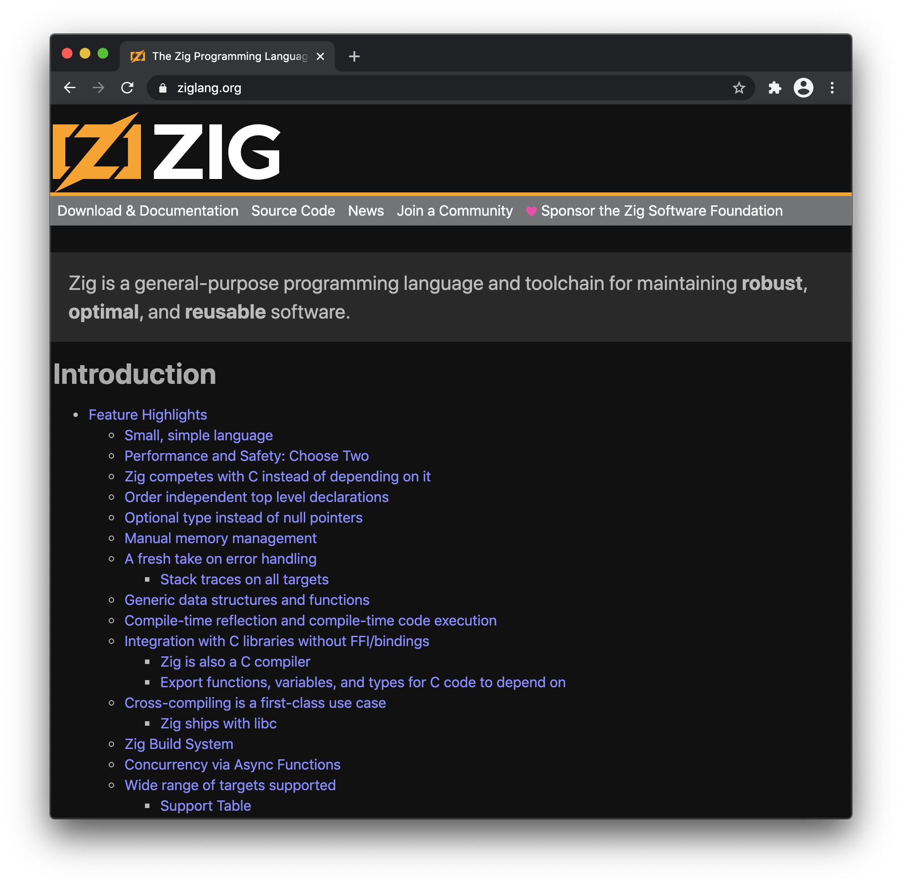
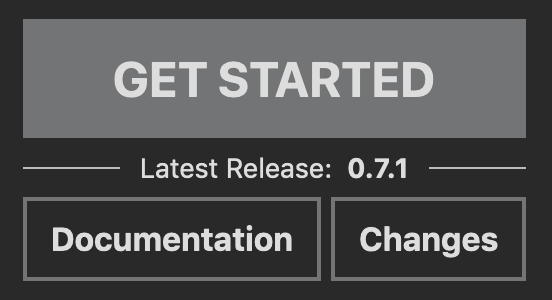

---
{
    .title = "The First Zig Website Redesign",
    .description = "A friendlier first impression for programmers with a wider range of backgrounds.",
    .author = "Loris Cro",
    .layout = "post.shtml",
    .date = @date("2021-01-13T00:00:00"),
    .draft = false,
}
---

Up until the publication of this post, if you went to the front page of [https://ziglang.org](https://ziglang.org), you would be greeted with a multi-page explanation about how Zig improves over the systems programming toolchains that today we take for granted.

If you have done enough of that kind of programming, you'll immediately see how Zig is tackling relevant problems, but if you don't have such experience, then the front page could very easily look like a never-ending list of things you don't have an opinion about.

When the Zig project started, its audience was almost exclusively people with a lot of relevant experience, since those would be the only ones able to evaluate the promise and limits of the newborn language.

Today we're at a point where Zig is becoming increasingly compelling for people coming from all layers of the stack. People have written [parser combinators](https://github.com/Hejsil/mecha), [2d game rendering libraries](https://github.com/prime31/zig-gamekit), [a live editor for GPU shaders](https://www.mattkeeter.com/projects/futureproof/), and much more. 

Don't get me wrong: all these projects have been developed by early adopters who wanted to try [a new and exciting](https://www.merriam-webster.com/dictionary/buggy) ecosystem. Zig is not yet stable, and won't be for a while, but we're getting there, and in the meantime Zig is already delivering big time on at least one promise: **making it possible to learn more about programming without having to first buy into vast amounts of accidental complexity**.

This redesign had two main goals and, as always, a few practical constraints. When it comes to constraints, it's mostly my web design and project management skills, and the scope that can be addressed in no more than a couple of months, since we needed a new website *now* and not one year from now. Let's now take a look at the goals.

## A friendlier first impression
The first goal addressed stems directly from the introduction of this blog post: we wanted to make the website more appealing to people that are looking at Zig as an opportunity to learn more about programming. For this reason, the lengthy breakdown has been moved to the Learn section and, in its place, we now have three short paragraphs that highlight some of Zig's major features, followed by a code sample that gives you a first taste of the syntax. 

Above the main introduction we still have the same slogan as before:

> Zig is a general-purpose programming language and toolchain for maintaining **robust**, **optimal**, and **reusable** software.

Andrew did an outstanding job at formulating it and I believe it's the one bit of the entire website that should probably never change.

Next to the slogan there's a new cluster of buttons. This is where I wanted to come up with an interesting compromise: we follow the popular trend of putting a big call to action for new users, but we also use that block of space to create a single hotspot where regulars can get access to critical information. 

My hope is for the big button to make new visitors become aware of that block and that, over time, checking there for docs and new releases just becomes muscle memory. That said, I know we'll have to tweak the design once the auto-generated docs for the standard library become good enough for the front page.

Below everything I just described, we introduce the community and the Zig Software Foundation. The Zig project has grown to a point where governance matters and we want to show we're doing everything the right way, up to the point of having formed a [nonprofit organization with a clear scope and mission statement](https://ziglang.org/zsf/).

## Internationalization
The second goal of this redesign was to open the door to hosting multiple translations of the website. Having an i18n-enabled website is beneficial for multiple reasons: it helps with the first goal (i.e. help a wider range of programmers get started with Zig), it's a good way of getting more use out of the informative materials we'll progressively add to the website, and it's also well aligned with the mission of the Zig Software Foundation. Lastly, I'm personally invested in the idea that we must ensure we don't leave it to third parties to be the sole owners of all content available in a given language, as we've already seen bad actors exploit their position to implement a form of cultural arbitrage.

We're well aware that keeping up with translations to multiple languages can quickly become an effort black hole. For this reason, I've tried to make sure the tooling would help in making the process as smooth as possible (more on that later), and I've also made sure to clarify in the design how translations are community-provided and thus best-effort.

At the moment of publication, the website can only offer [an Italian translation](https://ziglang.org/translations/) written by me. Italian was chosen out of necessity (i.e. it's the only other language I speak), but it served the purpose of making me try out the ergonomics of producing a translation, and it can also act as documentation for others.

Finally, I should point out that there are some parts of the website we don't plan to translate, like the News section, for example. This is another choice made out of necessity: we want to restrict translations to content with a long shelf life to reduce the amount of effort, but I don't exclude that one day we might have enough resources to get rid of this compromise.

## Implementation details
The new website is statically generated by [Hugo](https://gohugo.io/). I also considered [Zola](https://www.getzola.org/), but its i18n support is not complete yet. The website lists a number of Zig code snippets, with relative output. Andrew originally implemented a program to produce release notes and language reference. That program takes in code samples, applies syntax highlighting, runs the code, and reports the output as HTML (it even retains colors from the terminal). I took the original code and packaged it as a tool with a more general interface. I called it [zig-doctest](https://github.com/kristoff-it/zig-doctest) and it can be easily integrated with all kinds of static content generation tools.

Now a successful CI build of the [ziglang/zig](https://github.com/ziglang/zig) repository triggers a build of the website, allowing us to catch outdated code examples much more easily. This addresses concerns raised in the past by people that would occasionally stumble upon a broken code sample.

Testing all code snippets is not instant as some tests include running the executable and capturing its output, so I made sure to integrate with Hugo's caching system. I also noticed that Hugo processes tags sequentially within the same page, so I also [added to it](https://github.com/kristoff-it/hugo) a warmup routine that makes sure to parallelize the testing when loading the development server the first time.

The result is a very enjoyable development experience that only depends on Zig and two additional executables (Hugo and doctest) to be able to develop the Zig website locally, resulting in an acceptable experience for potential contributors. 

## Conclusion
I hope this post explains adequately the intent of this work and the practical limits of its execution. There's still more work to do, but this seems a reasonable milestone for a first release, so I'm looking forward to working alongside the community to improve and add translations to the website.

For the next iteration I'll work on improving accessibility, but first I have to focus on [FOSDEM, since we have a Zig dev room](https://fosdem.org/2021/schedule/track/zig_programming_language/) and I have a bunch of duties to attend to. 

When I first discovered Zig, I saw it as a way for me to learn more about all the aspects of programming I missed when working with interpreted and/or garbage-collected languages. Turns out I got to learn that [and much more](https://ziglang.org/news/announcing-zig-software-foundation/), and I can't tell you how excited I am about what's to come. Despite everything, 2020 was a great year for Zig, and I fully expect 2021 to be even better.

