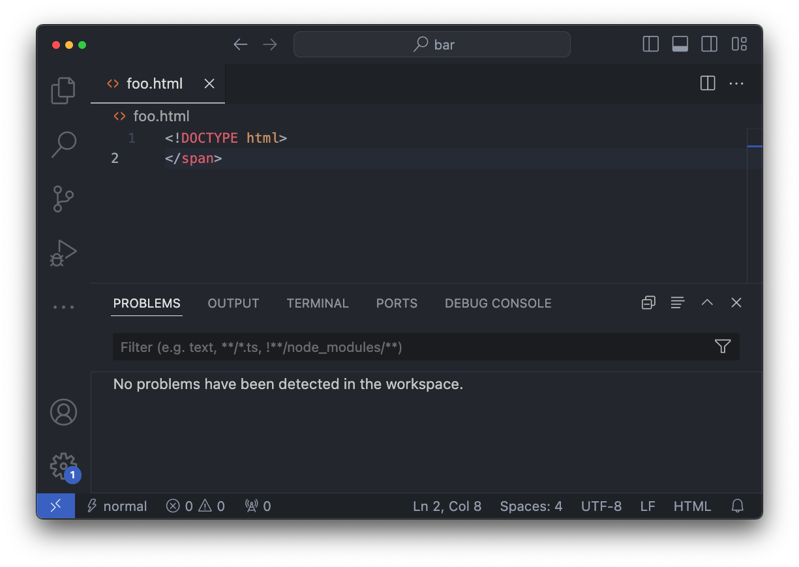

---
{
    .title = "The Zen Of Writing A HTML Language Server In Zig",
    .description = "",
    .author = "Loris Cro",
    .layout = "post.shtml",
    .date = @date("2024-07-05T00:00:00"),
    .draft = true,
}
---

In this blog post I want to tell you about my journey writing a HTML parser from scratch (which I used to power a language server) to then motivate some reasonings about modern software engineering.

## The status quo
Open VSCode and type in a new file some wrong HTML code, like `` (i.e. closing a tag that was never opened). VSCode won't bat an eye.

Even more damning is how it behaves with self-closing tags (not to be confused with [void elements](https://developer.mozilla.org/en-US/docs/Glossary/Void_element)). 

As a reminder, `<foo/>` would be a self-closing tag, which in XML lingo is short-hand for `<foo></foo>`. Unfortunately, HTML does not support self-closing tags and in fact [browsers are required to ignore the trailing slash](https://developer.mozilla.org/en-US/docs/Glossary/Void_element#self-closing_tags), as many different groups of people have been [recently re-discovering](https://github.com/sveltejs/svelte/issues/11052).

But the autoformatter that ships with VSCode implements a very generic xml-ish HTML grammar that doesn't take that nuance into account and consequently gives you **misleading indentation**:

<video controls autoplay loop disablepictureinpicture muted>
 <source src="/vscode-self-closing.mp4">
</video>

In this video you can see VSCode erroneously consider `
` a sibling element of `
`.

