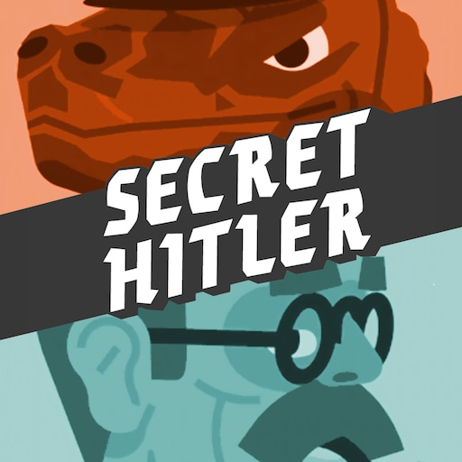
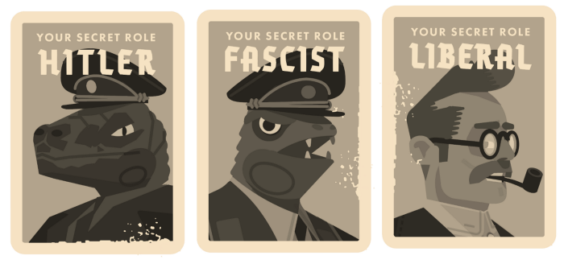

---
{
    .title = "You Should Play Secret Hitler",
    .description = "Let's talk about Secret Hitler, now that everyone is playing Among Us and Among U.S.",
    .author = "Loris Cro",
    .layout = "post.html",
    .date = @date("2020-10-22T00:00:00"),
    .draft = false,
}
---

In games like D&D, you start by creating a character for yourself. The character has a background, a set of skills and a personality of their own. Ideally, you should try to play characters with a different disposition than yours, and part of the enjoyment is acting like them, to the point of even occasionally making disastrous choices knowingly, because that’s what the character would do.

In Secret Hitler, you are but yourself and the only thing that changes is whether your goal is to subvert the German republic or to maintain democracy. This is in my opinion a beautiful inversion of what you can get out of role-playing games; one that has great teaching potential, especially when implemented in a game as elegant as Secret Hitler.

The setting of Secret Hitler is the pre-WW2 German parliament. Taken from the official website:

> Players are secretly divided into two teams: the liberals, who have a majority, and the fascists, who are hidden to everyone but each other. If the liberals can learn to trust each other, they have enough votes to control the elections and save the day. But the fascists will say whatever it takes to get elected, advance their agenda, and win the game.

If you've never played Secret Hitler, watch the following 5-minute video to get an idea of the mechanics, which is necessary to better understand the rest of this blog post.

<iframe width="560" height="315" src="https://www.youtube-nocookie.com/embed/APiugylcAJw" frameborder="0" allow="accelerometer; autoplay; encrypted-media; gyroscope; picture-in-picture" allowfullscreen></iframe>

 If you want to see a full game being played, there’s [an entire series](https://www.youtube.com/watch?v=k69PbHoSWm4) by the late TotalBiscuit on YouTube. You can buy a physical copy of the game from the official website (beware of fake copies on Amazon, especially in EU!), or you can buy [Tabletop Simulator](https://store.steampowered.com/app/286160/Tabletop_Simulator/) to play it online with friends. My personal recommendation is to play in 7 or 8 players (preferably 8) total, as I think it's the most interesting configuration.

## Playing Liberal
When playing as a liberal there are three main important things that you realize are fundamental, in increasing order of difficulty.

### Telling the truth
When you play your first ever game of Secret Hitler, even if you're liberal, you might be tempted to lie when in a bad situation. I remember one particularly anxious new player who, while serving as president, accused their chancellor of having discarded a blue card, even though it was just a bad draw in reality. This happened because the president *really* wanted to avoid being suspected.

After a couple of games, you realize that that's not how liberals should play. When something bad happens, you have to own it because liberals need to build trust, and that can only happen by all converging to a common interpretation of the game state. This part is obvious, but the same applies to more nuanced aspects of social interaction, some of which take longer to internalize, like avoiding carelessly throwing around accusations, for example.

It truly is hard to tell the whole truth: we often mistake an initial (emotional) reaction as something that we're entitled to have, without having to provide any explanation for it or -- worse -- we hastily map it to unrelated events when challenged on it. Secret Hitler systematically puts people in a position of having asymmetrical access to information, where this communication flaw is stressed, especially when fascists can exploit it to break the trust between liberals.

### Paying attention
Every round and every verbal exchange are opportunities for fascists to add chaos and slightly bend the truth. It's not just enough to look at the cards and see who plays blue and who plays red, it's also important to evaluate how people react to each play. A liberal that hasn't mastered the previous point might overreact to an unfavorable play, but most of the time fascists will have an active interest in being overly critical of unlucky liberal draws, for example. You have to be mentally present when the situation unfolds because a liberal that doesn't pay attention is almost functionally equivalent to a fascist.

### Keeping an open mind
Occasionally you will be put in a position to know with full certainty that another player is fascist, but most of the time you will only have circumstantial evidence at best. It's easy to forget the small uncertainty that every piece of information still carries and become increasingly convinced that one other player is fascist, as the game progresses. This can lead to situations where a liberal becomes irremediably convinced of a false fact. Improving in this aspect will only make you win a small fraction of games that would otherwise be lost but, if you've mastered the previous points, you're now at a stage where quality should matter more than quantity.

## Playing fascist
For fascists, the game plays out in a very different way than liberals. Depending on your fascist role, and what winning condition is the closest, your playstyle will have to be different, but let's talk about high-level points like we did for liberals in the previous section.

### Exploit asymmetry 
The starting point in your fascist career is to lie. Draw 2 red and 1 liberal card and claim you drew 3 reds right after discarding the blue one. This is where asymmetry works entirely in your favor and you can even take it further. When you're Chancellor, if the situation requires you to expose yourself a little, discard a liberal card that your President gave you and claim you received two reds. The president will know that you're lying and will argue against you, but the other players will not know which to believe without further evidence. The same applies to the "show party membership card" power. This in isolation will "burn" both you and the liberal player, but you can make up for it with the next points.

### Make friends
In the previous point, the lying didn't help you gain any favor (or outright made an enemy of your President), but fascists should also make sure to use information asymmetry to make friends. Find a liberal that can be key to victory and make friends with them by playing honestly when paired with them, agreeing on their discussion points, and by showing them that you're a competent player by analyzing the game well. Of course, it's easier for you to be good at analyzing the game since you have access to more information than the average liberal. In this case, the idea is to make positive use of the information you have at your disposal to gain social capital so that you can subsequently spend it to sneak in an extra red card, or to get Hitler elected at the right moment.

### Shift focus
If the goal for liberals is to reach a consensus over the state of the game, the fascists want to make sure no liberal gets there. The highest level of fascist play can be summed up in  "make the liberals focus on the wrong things". As with many other concise definitions, it hides a very complex set of nuanced rules and tactics, but that's what everything boils down to. You could start by pointing out that a liberal player has taken a bit too long to discard a card, for example, but know that this is a blunt tool and it shouldn't be abused. A slightly more sophisticated tactic could be to note how it's improbable that for two or three times in a row only fascist cards were drawn, precisely in those games when this happens (to liberals). There's a very long list of things you can say. Some rely on exploiting your friends' flaws as liberals, others simply rely on making a bit of confusion and make people forget a small, yet crucial detail.

## Playing the game
Playing the game is a lot of fun and there are also some other things that you can try to make your games more interesting. As an example, there are some tactics where you might want to try to lie as a liberal. The problem is that those are risky, flashy plays that look great when they succeed, and kill the game when they fail. One similar example for fascists would be, as Hitler, to accuse a fascist, simultaneously lowering your chances of victory, while rising your chances of being elected Chancellor. Those are fun things to try but I'd argue that they won't make you improve as a player as much as the points in the previous sections.

## Playing a role
In role-playing games like D&D you engage actively in storytelling, but after playing enough Secret Hitler you realize that with the right set of constraints, a distinct red/blue personality emerges, creating an organic story, not one build on whimsical artificiality. The creators of the game [know full well that Secret Hitler is a machine for building exciting stories](https://www.youtube.com/watch?v=6-IJZrrMFpE) and made sure to tweak the design for that goal. That alone would be reason enough to play this game, but there's one more layer of great learning that awaits inside the box (or the Tabletop Simulator lobby), and that's a connection with the real world.

This blog is from somebody with a technical background, for people with a technical background. I don't like admitting it, but being good at the technical details sometimes means being less good at understanding why things are the way they are when it comes to society and the kinds of things that are mostly comprised of people. Secret Hitler gives you a glimpse at some of the gears that power politics, commerce, and communities of all kinds. Learn how these work and you will unlock potential for a lot of satisfaction, as you will be able to better calibrate your expectations for all kinds of things, helping you make rational decisions and avoid falling inside the pit of apathy that looks so tempting when all you can observe from society at large seem just unreasonably stupid flaws, like not even being able to tell when somebody is lying.
